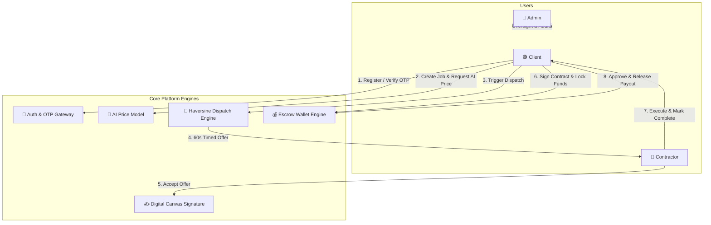
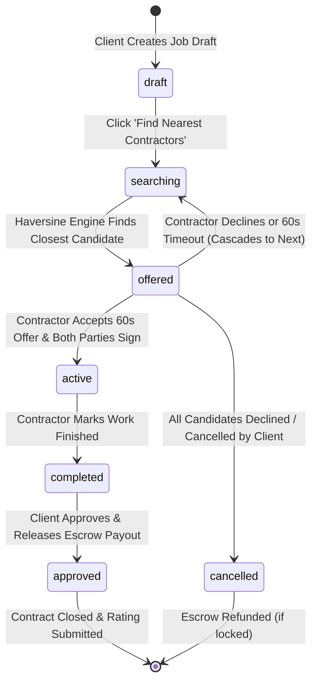
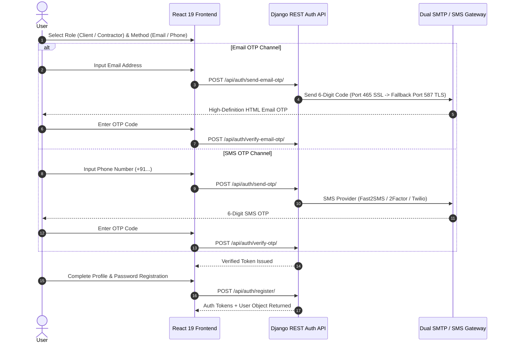
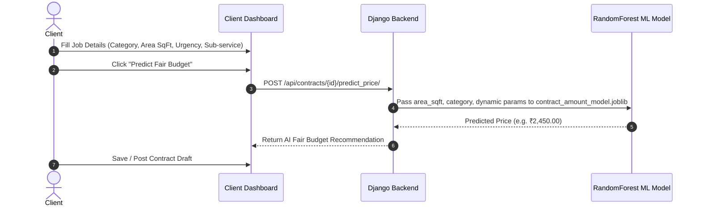
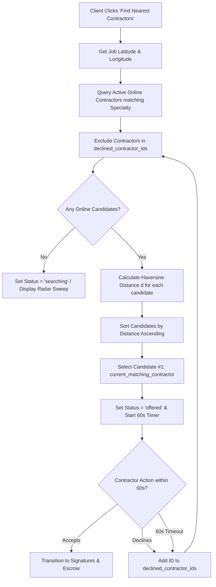
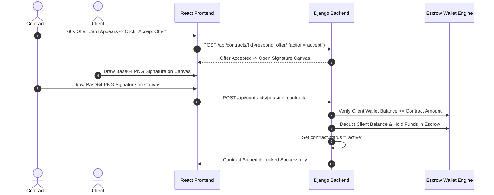
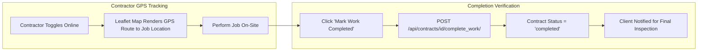
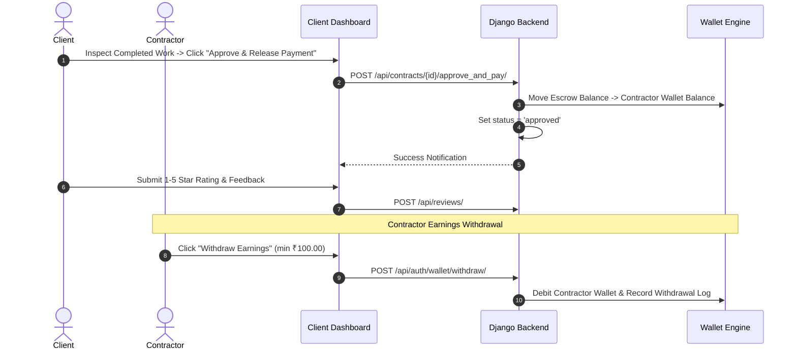
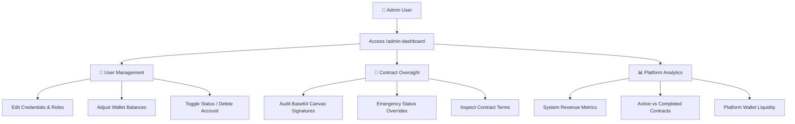

# 🔄 Contrax — Project Workflow & System Architecture Guide

Welcome to the **Contrax** project workflow guide. This document presents a clear, visual, and comprehensive breakdown of how Contrax operates end-to-end—from user onboarding to AI price prediction, Uber-style location dispatching, HTML5 digital signatures, escrow wallet settlement, and administrative oversight.

---

## 📑 Table of Contents

1. [📌 High-Level Ecosystem Overview](#1--high-level-ecosystem-overview)
2. [📊 Master Contract State Machine](#2--master-contract-state-machine)
3. [🚀 End-to-End User Workflows](#3--end-to-end-user-workflows)
   - [3.1 Phase 1: Authentication & User Onboarding](#31-phase-1-authentication--user-onboarding)
   - [3.2 Phase 2: Client Job Posting & AI Budget Prediction](#32-phase-2-client-job-posting--ai-budget-prediction)
   - [3.3 Phase 3: Sequential Distance Dispatch Engine (Uber-Style)](#33-phase-3-sequential-distance-dispatch-engine-uber-style)
   - [3.4 Phase 4: Offer Acceptance & Digital Signature Escrow](#34-phase-4-offer-acceptance--digital-signature-escrow)
   - [3.5 Phase 5: Work Execution & GPS Route Tracking](#35-phase-5-work-execution--gps-route-tracking)
   - [3.6 Phase 6: Client Verification, Escrow Release & Rating](#36-phase-6-client-verification-escrow-release--rating)
   - [3.7 Phase 7: Admin Oversight & System Audit](#37-phase-7-admin-oversight--system-audit)
4. [📂 Codebase to Workflow Mapping Matrix](#4--codebase-to-workflow-mapping-matrix)
5. [⚡ Local Quickstart & Testing Guide](#5--local-quickstart--testing-guide)

---

## 1. 📌 High-Level Ecosystem Overview

Contrax operates as a real-time, location-aware marketplace connecting three main user roles:



---

## 2. 📊 Master Contract State Machine

Every contract on Contrax follows a strictly enforced state transition lifecycle:



### 📋 Contract State Reference Table

| Status | State Description | Responsible User | Trigger API Endpoint | Next Possible Status |
| :--- | :--- | :--- | :--- | :--- |
| **`draft`** | Job form filled with category, area (sqft), and optional AI price prediction. | Client | `POST /api/contracts/` | `searching`, `cancelled` |
| **`searching`** | Radar sweep active; Haversine engine scanning online contractors. | System | `POST /api/contracts/{id}/start_matching/` | `offered`, `cancelled` |
| **`offered`** | 60-second offer card active for current nearest contractor candidate. | Contractor | Automatic / Internal Engine | `active`, `searching`, `cancelled` |
| **`active`** | Both parties signed HTML5 Base64 signature canvas; funds locked in escrow. | Both | `POST /api/contracts/{id}/sign_contract/` | `completed`, `cancelled` |
| **`completed`** | Work finished on site; proof submitted. | Contractor | `POST /api/contracts/{id}/complete_work/` | `approved`, `cancelled` |
| **`approved`** | Client verified work; escrow wallet funds transferred to contractor. | Client | `POST /api/contracts/{id}/approve_and_pay/` | Closed (`[*]`) |
| **`cancelled`** | Contract terminated; escrow returned if locked. | Client / Admin | `POST /api/contracts/{id}/cancel/` | Closed (`[*]`) |

---

## 3. 🚀 End-to-End User Workflows

### 3.1 Phase 1: Authentication & User Onboarding



---

### 3.2 Phase 2: Client Job Posting & AI Budget Prediction



---

### 3.3 Phase 3: Sequential Distance Dispatch Engine (Uber-Style)



> 📐 **Haversine Distance Formula**:
> $$d = 2r \arcsin \left( \sqrt{ \sin^2\left(\frac{\Delta lat}{2}\right) + \cos(lat_1) \cos(lat_2) \sin^2\left(\frac{\Delta lon}{2}\right) } \right)$$

---

### 3.4 Phase 4: Offer Acceptance & Digital Signature Escrow



---

### 3.5 Phase 5: Work Execution & GPS Route Tracking



---

### 3.6 Phase 6: Client Verification, Escrow Release & Rating



---

### 3.7 Phase 7: Admin Oversight & System Audit



---

## 4. 📂 Codebase to Workflow Mapping Matrix

To make development and debugging effortless, here is where each workflow step lives in the code:

| Workflow Step | Frontend Component | Django Backend API Endpoint | Backend Model / Service Logic |
| :--- | :--- | :--- | :--- |
| **Authentication & OTP** | [Register.jsx](file:///f:/Sem-4/Project/frontend/src/pages/Register.jsx), [Login.jsx](file:///f:/Sem-4/Project/frontend/src/pages/Login.jsx) | `POST /api/auth/send-email-otp/`<br>`POST /api/auth/verify-email-otp/` | `users/views.py`<br>`users/models.py` |
| **AI Price Prediction** | [CreateContractModal.jsx](file:///f:/Sem-4/Project/frontend/src/components/CreateContractModal.jsx) | `POST /api/contracts/{id}/predict_price/` | [predict.py](file:///f:/Sem-4/Project/ml/predict.py)<br>`contract_amount_model.joblib` |
| **Distance Dispatching** | [RadarSearch.jsx](file:///f:/Sem-4/Project/frontend/src/components/RadarSearch.jsx), [ClientDashboard.jsx](file:///f:/Sem-4/Project/frontend/src/pages/ClientDashboard.jsx) | `POST /api/contracts/{id}/start_matching/`<br>`POST /api/contracts/{id}/respond_offer/` | `find_and_assign_next_contractor()` in [views.py](file:///f:/Sem-4/Project/backend/contracts/views.py) |
| **Canvas Signature Pad** | [SignaturePad.jsx](file:///f:/Sem-4/Project/frontend/src/components/SignaturePad.jsx) | `POST /api/contracts/{id}/sign_contract/` | `client_signature`, `contractor_signature` in [models.py](file:///f:/Sem-4/Project/backend/contracts/models.py) |
| **Escrow Wallet Settlement** | [Navbar.jsx](file:///f:/Sem-4/Project/frontend/src/components/Navbar.jsx), [ClientDashboard.jsx](file:///f:/Sem-4/Project/frontend/src/pages/ClientDashboard.jsx) | `POST /api/contracts/{id}/approve_and_pay/`<br>`POST /api/auth/wallet/` | `wallet_balance` field in `users/models.py` |
| **GPS Route Navigation** | [ContractorDashboard.jsx](file:///f:/Sem-4/Project/frontend/src/pages/ContractorDashboard.jsx) | `POST /api/auth/user/` (GPS Coords Update) | Leaflet GPS Map Component |
| **Admin Control** | [AdminDashboard.jsx](file:///f:/Sem-4/Project/frontend/src/pages/AdminDashboard.jsx) | `GET/PUT/DELETE /api/users/`<br>`GET/PUT /api/contracts/` | `is_staff`, `is_superuser` role permissions |

---

## 5. ⚡ Local Quickstart & Testing Guide

To test the entire workflow on your local machine:

1. **Launch standard project environment**:
   Double click [run_project.bat](file:///f:/Sem-4/Project/run_project.bat) or execute:
   ```cmd
   backend\venv\Scripts\activate
   python backend\manage.py runserver
   ```
   In a separate console:
   ```cmd
   cd frontend
   npm run dev
   ```
2. **Open Application**: Navigate to `http://localhost:5173/` in your web browser.
3. **Simulate Full Flow**:
   - Register as **Client** ➔ Post a job ➔ Predict fair price ➔ Click *Find Nearest Contractors*.
   - In an incognito tab, login as **Contractor** ➔ Toggle *Online* ➔ Accept the 60s offer popup ➔ Sign contract ➔ Mark complete.
   - Switch back to Client tab ➔ Approve work ➔ Escrow funds instantly transfer to Contractor wallet!

---

<div align="center">

**Contrax System Workflow Documentation**  
&copy; 2026 Contrax Inc. All rights reserved.

</div>
